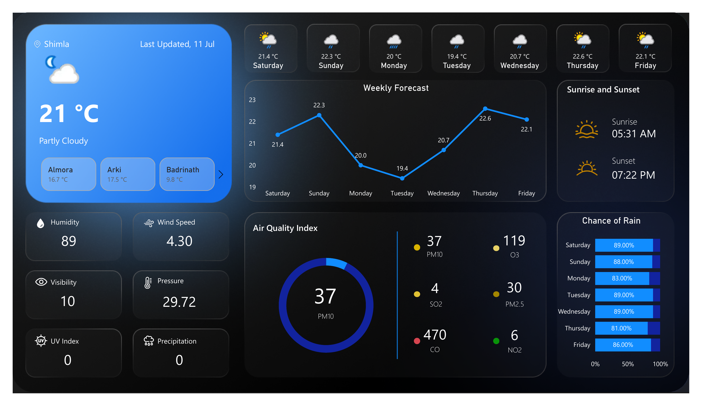

# ☁️ Real-Time Weather Dashboard using Power BI and WeatherAPI

This project is a **real-time weather monitoring dashboard** built using **Power BI Desktop**, powered by data fetched from the **WeatherAPI**. It provides live weather updates, weekly forecasts, humidity levels, air quality metrics, and more — visualized in an interactive, user-friendly format for better climate awareness.

## 📌 Features

- 🌡️ Current temperature display for multiple Indian cities (e.g., Shimla, Almora, Badrinath, Arki)
- 🌥️ Weekly weather forecast visualization with temperature trends
- 💧 Humidity, wind speed, pressure, precipitation, and UV Index insights
- 🌅 Sunrise and sunset times
- 🌧️ Rain probability and daily percentage chances
- 🌀 Real-time Air Quality Index with pollutants breakdown (PM10, PM2.5, NO₂, CO, SO₂, O₃)
- 🔄 Automatic data refresh from WeatherAPI

## 🧰 Tech Stack

- **Power BI Desktop**
- **WeatherAPI** (for live weather data)
- **Power Query (M)** and **DAX** for data transformation and calculations

## 🔧 How It Works

1. Weather data is fetched via API from [WeatherAPI.com](https://www.weatherapi.com/).
2. Power Query is used to clean, reshape, and load data.
3. DAX measures are used for calculations and KPIs (e.g., average temperature, max humidity).
4. Visualizations include:
   - Cards for city-wise temperatures
   - Line and bar charts for forecast and AQI
   - Custom visuals for sunrise/sunset, rain probability, and more

## 📍 Use Cases

- Useful for travelers, city planners, and environmental monitoring teams.
- Can be integrated into smart cities dashboards.
- A great Power BI portfolio project for Data Analysts.

## 🚀 Deployment Note

To deploy or use this dashboard on your system:

1. Clone or download this repository.
2. Get a free API key from [WeatherAPI](https://www.weatherapi.com/).
3. Open the Power BI `.pbix` file and replace the sample API key in Power Query.
4. Refresh the dashboard to fetch live data.
5. Customize visuals or cities as per your requirement.

> ✅ This dashboard requires internet connectivity to fetch real-time weather data.

## 📸 Sample Snapshot

## 👨‍💻 Author

**Kartikey Sharma**  
_B.Tech in Computer Science with specialization in Data Science_  
🔗 [LinkedIn]https://www.linkedin.com/in/kartikey-sharma-313305251

---

> ✨ Feel free to fork, star ⭐, or contribute to make it even better!

